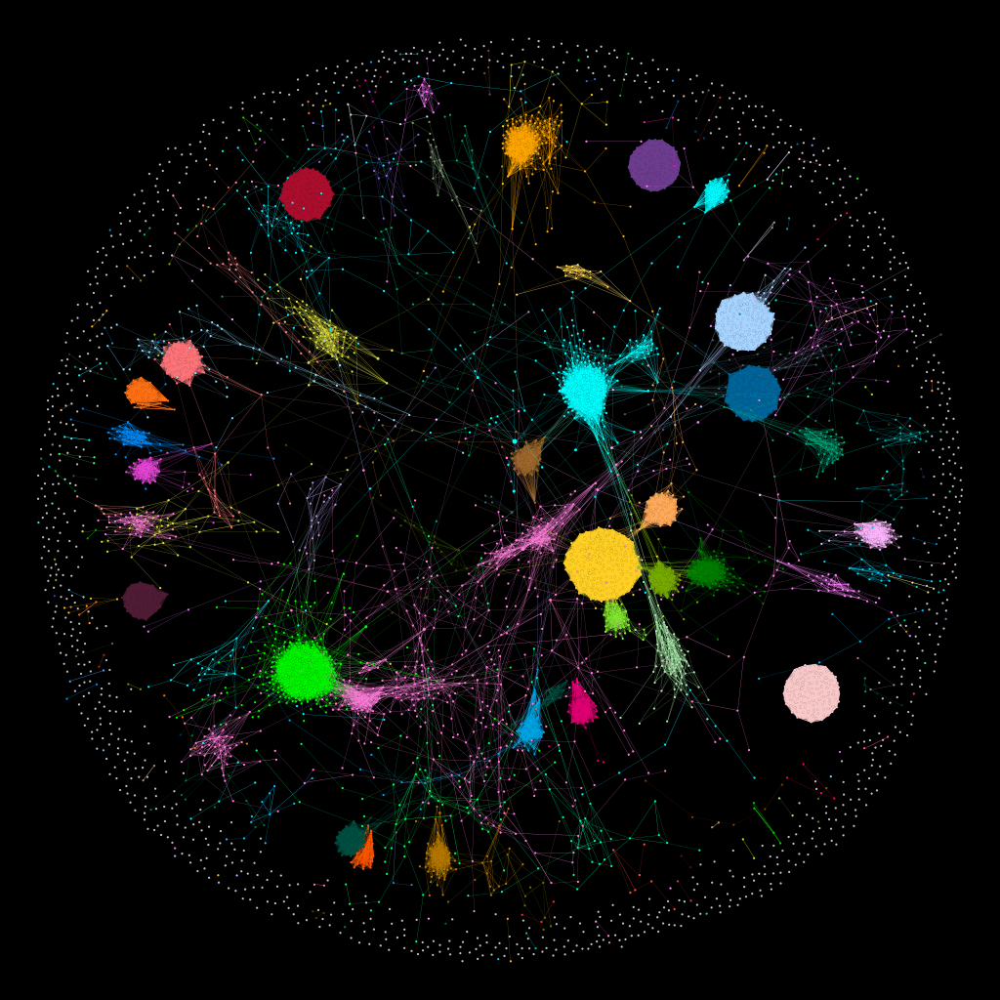
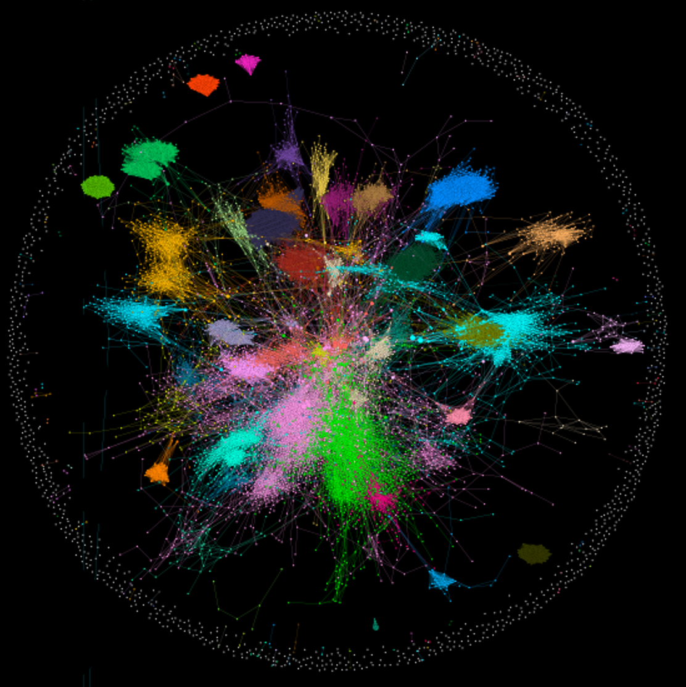

# Course_Enrollment_Community_Detection
* Conducted a study to compare the community detection algorithms and actual major/minor selection by visualizing course enrollment network and matrix calculation
* Presented at Data@KU [newsletter](https://data.korea.ac.kr/?p=5869)

##Louvain Community Detection of Course Enrollment by Freshmen & Sophomore in 2021 Spring semester 

##Louvain Community Detection of Course Enrollment by Junior & Senior in 2021 Spring semester

